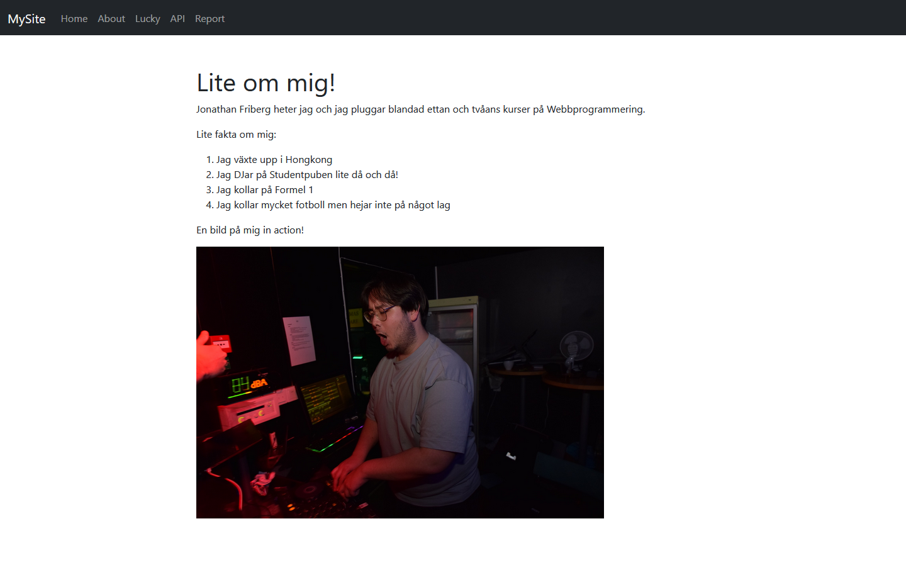

# MVC Project - Webbprogrammering

Welcome to my school project for the course "mvc" in the program Webbprogrammering in Blekinge Institute of Technology.
This is a Symfony-based web application built using Twig, PHP, controllers and API.

## Getting started

Follow these steps to clone the repo and start the project locally

1. Clone the repo

```bash
git clone https://github.com/jonathanfriberg/mvc.git
cd mvc
```

2. Install dependencies

Make sure you have PHP, Composer, and Symfony CLI installed.

Then run:
```bash
composer install
```

3. Start the development server

```bash
symfony server:start
```

## Project structure
src/Controller - All controllers, routes
templates/ - Twig templates
public/ - Public files, images for example

